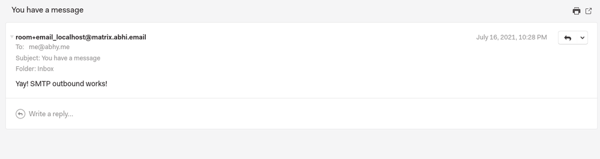

# Bridges?!

🥶 It's already a little late for the updates. Some of you might have heard about the [Google Summer of Code program](https://summerofcode.withgoogle.com/) (Actually, it's one of the longest-running programs from Google xD). This year [my proposal](https://summerofcode.withgoogle.com/archive/2021/projects/5681164035031040) also got accepted into GSoC under Matrix.org.
So, why Matrix?

For the past 2-3 years, the order of choices to get in touch with me were, Email > Matrix > Telegram. If you still don't know 'Matrix', it is an open, federated network for decentralized communication (It's amazing!). The best way to think of Matrix is described on their [homepage](https://matrix.org):

> Imagine a world...
> * ...where it is as simple to message or call anyone as it is to send them an email.
> * ...where you can communicate without being forced to install the same app.
> * ...where you can choose who hosts your communication.
> * ...where your conversations are secured by E2E encryption.
> * ...where there’s a simple standard HTTP API for sharing real-time data on the web.

That's Matrix. Check out the homepage. It contains a better interactive illustration of how does it work. Try it out, it's very cool! Why should I look anywhere else other than Matrix, one of my primary communication tool? [Akhil](https://mastodon.social/@akhilvarkey/) and I used to discuss some design decisions and progress of Matrix (he does most of the talking and I would listen 😁) often. He gave me the push to apply for GSoC this year at Matrix.

### Gist

I like Matrix, I like emails, combining both of these worlds would be an interesting thing to see. This project would enable anyone on the internet with an Email ID to communicate with Matrix users and from there to a number of bridged networks.
So far

### Progress

So far, we have accomplished a few things.

> The bridge is now able to talk SMTP bidirectionally with [this](https://github.com/abbyck/matrix-appservice-email/pull/4) commit. The main advantage of having the bridge and the MTA in a single process is to reduce the complexity of maintaining a full blown mail-server or to pay for an SMTP server. So we would not require an external MTA such as Postfix or Exim to be maintained along with the bridge making it a simple addon to a homeserver.

 displayed on a Matrix room.")

> External emails sent to an address like room+matrix_matrix.org@matrix.org will be delivered to #matrix:matrix.org.
> Messages from a matrix room can be delivered to an email address, which is currently hardcoded.

Message from a Matrix room sent to a bridged email user in that room. 

We almost have a working bridge with the following things remaining.

>  Mapping email users to room aliases and for DMs. Which will enable us to deliver outbound to the correct recipient.
>  Provide configurability for outbound DKIM (DKIM suport is working independently) .
>  Rspamd/SpamAssasin integration for spam protection.
>  Add more configurable options for email delay, leaving room(unsubscirbe) etc.

So far, it was an amazing experience. With my final semester examinations and project things happening simultaneously (the schedule was changed due to COVID-19), it was a little hard to switch contexts between GSoC and classroom works. Now we're past that.

I had some hiccups starting. Documentation felt a little confusing initially, but thanks to my awesome mentors [Half-Shot](https://half-shot.uk/) and [Tulir](https://mau.fi/) for answering all the queries I had and helping me get on track.

That's all for now. Hopefully, by the comming weeks, we would have a near perfect email bridge :)
